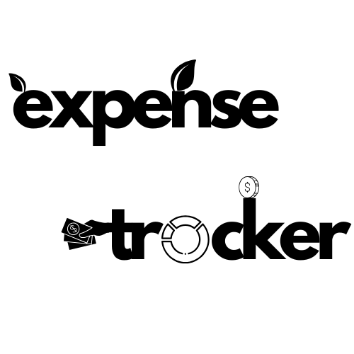

# 💰 Flask Expense Tracker

An interactive and secure expense tracking web app built with **Flask**, **Pandas**, **Matplotlib**, **Jinja2**, and **JavaScript**. It lets users log their daily expenses, visualize spending trends, manage savings goals, and view insightful dashboards.
<p align="center">
  
</p>

---

## ✨ Features:

- 🔒 Encrypted account credentials and budgets
- 🧾 Daily expense logging by category
- 📈 Dashboard with:
  - Pie chart (category distribution)
  - Line graph (spending trends)
  - Bar chart (budget % per day)
- 💬 Insight messages to guide your saving behavior
- 📊 Automatically generated expense tables
- ⚙️ Change income or saving goal from settings
- 🗃 Data stored in `Expenses.csv` and `Classified.csv`

---

## 🛠 Tech Stack:

- **Backend:** Python(Flask, Pandas)
- **Frontend:** HTML, CSS, JavaScript
- **Visualization:** Matplotlib
- **Encryption:** Self-made `simple_encrypter` module

---

## 📸Dashboard preview:

| Chart                                  | Description                |
| -------------------------------------- | -------------------------- |
|     | Expense by category        |
|  | Daily spending trend       |
|    | Daily spending % of budget |

---

## 🕹 Demo link
Try the app using this link: [Expense Tracker](https://web-expense-tracker-production.up.railway.app/)

---

## 📕Guide
1. open the demo link
2. click `sign up`
3. add your email password income and saving goal and click sign up
4. add your expenses by clicking on `add data` (do this daily)
5. click `generate dashboard` and see the insights and info about your spending patterns
6. if you want to change the entered income or saving goal, click on the last button and change them.

---

## 🚀 Getting Started

### 1. Clone the Repo

```bash
git clone https://github.com/your-username/flask-expense-tracker.git
cd flask-expense-tracker
```
### 2. Install Requirements
```bash
pip install flask pandas matplotlib jinja2
```
### 3. Create Required Files
<strong>Ensure you have:</strong><br>

- `Expenses.csv` and `Classified.csv` in the root directory

- A templates/ folder with:

  - home.html
  - login.html
  - signup.html
  - options.html
  - categories.html
  - dashboard.html
  - change.html
  - template.html
  - error.html

- A static/ folder with:
  - `login.css`
  - a `JS` file for almost each html file
  - charts/ folder for saving generated charts
### 4. Run the App
```bash
python main.py
```
Then visit:
📍 <a href='http://localhost:5000'>http://localhost:5000</a>

---

## 🔐 About `simple_encrypter`
Handles encryption and decryption of passwords and income using symmetric encryption.
If you are intrested, I have a repo only for it here: 
<a href='https://github.com/kevin-ehab/simple-encrypter'>simple-encrypter</a>

---

## 🙌 Credits
Developed by <strong>Kevin Ehab</strong>
